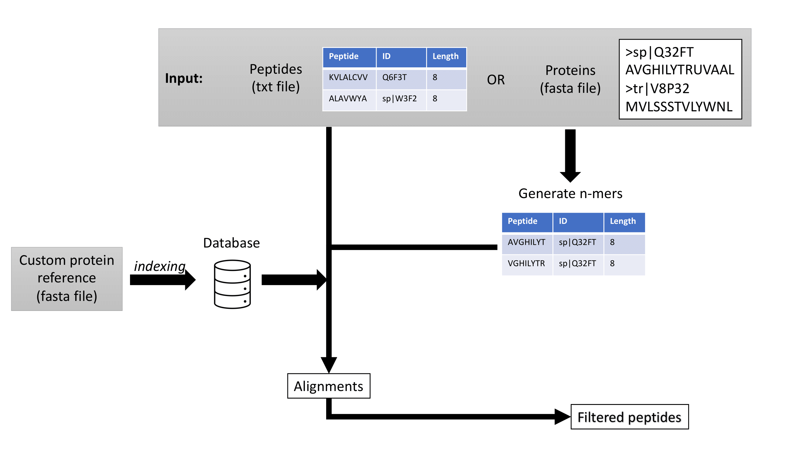

# MRP


Match a series of peptides into a custom reference proteome and filter the identical matches

# Description and workflow

This tool is aimed to filter out any peptide that aligns perfectly to any entry in a custom protein reference. It takes as input a protein fasta file and generates all possible derived n-mer peptides for each protein through a slidding window scan with a pre-defined minimum and maximum length. It can directly take as input the peptides list in a text file with a column named 'peptides'. 

The custom protein reference must be in fasta format, which will be indexed prior to aligning. Each peptide will be aligned into the reference and the perfect matches will be dropped from the list. 

The tool was originally designed for filtering MHC Class I peptides that match the human proteome, in order to prioritize foreign peptides for immunogenicity assays. 

 

# Input files

There are two possible input formats:
  - Protein (fasta file): Directly a fasta file that contains all the proteins that will be chopped into all possible peptides of certain length. The fasta file will be converted into a csv file with 3 columns: peptide (protein sequence of the peptide), ID (corresponding header of the fasta file) and length(peptide length).
  - Peptide (text file): Alternatively, a peptides text file can be provided with additional information in both, csv and tsv formats. All the peptide sequences must be placed at a single column named `peptide`.
 
The reference protein fasta file needs to suit the FASTA format. 
 
# Usage examples
 
The tool can run easily on the data examples provided in this repository, using SwissProt human proteome as a reference.
 
To run with an input fasta file:
```
python main.py -i test/test.fasta -r test/swissprot.fasta
```

To run with an input peptides file:
```
python main.py -i test/test_peptides.csv -r test/swissprot.fasta
``` 

Besides, a full output can be generated, storing all the alignments and the peptides table before filtering, along with the indexed database.

```
python main.py -i test/test_peptides.csv -r test/swissprot.fasta --full
``` 

A customized parameters run might include specific lengths for the peptides generated and a reduced number of alignments for each peptide.
```
python main.py -i test/test_peptides.csv -r test/swissprot.fasta -min_length 9 -max_length 11 -n_alignments 2 --full
``` 

# Options and parameters

```
usage: main.py [-h] [-i INPUT] [-r REF] -min_length MIN -max_length MAX -n_alignments NALIGN --full 

mandatory arguments:
-i, --input     Input fasta or peptides(txt, csv, tsv) file
-r , --reference      Reference protein fasta file to match against

optional arguments:
-min_length     Minimum peptide length when applying the sliding window, by default 8. (Only aplicable for FASTA input format)
-max_length     Maximum peptide length when applying the sliding window, by default 11. (Only aplicable for FASTA input format)
-n_alignments     Number of alignments retrieved for each peptide entry, by default 5.
--full      Generate full results, including all the alignments for each peptide, the complete list of peptides before filtering, the indexed database and the filtered peptides list. By default only the last one is provided.
```

# Requirements 

Relevant dependencies required for running the code are listed below

```
bio==1.5.9
biopython==1.81
biothings-client==0.3.0
certifi==2022.12.7
charset-normalizer==3.1.0
gprofiler-official==1.0.0
idna==3.4
mygene==3.2.2
numpy==1.24.3
packaging==23.1
pandas==2.0.1
platformdirs==3.5.0
pooch==1.7.0
python-dateutil==2.8.2
pytz==2023.3
requests==2.29.0
six==1.16.0
tqdm==4.65.0
tzdata==2023.3
urllib3==1.26.15
```

# Future insights

- Currently, run time is very large for huge number of peptides
- Using formal databases instead of pandas dataframes might speed the process
- Using pre-indexed references instead of fasta files increases the speed but takes dozens of Gb storage
